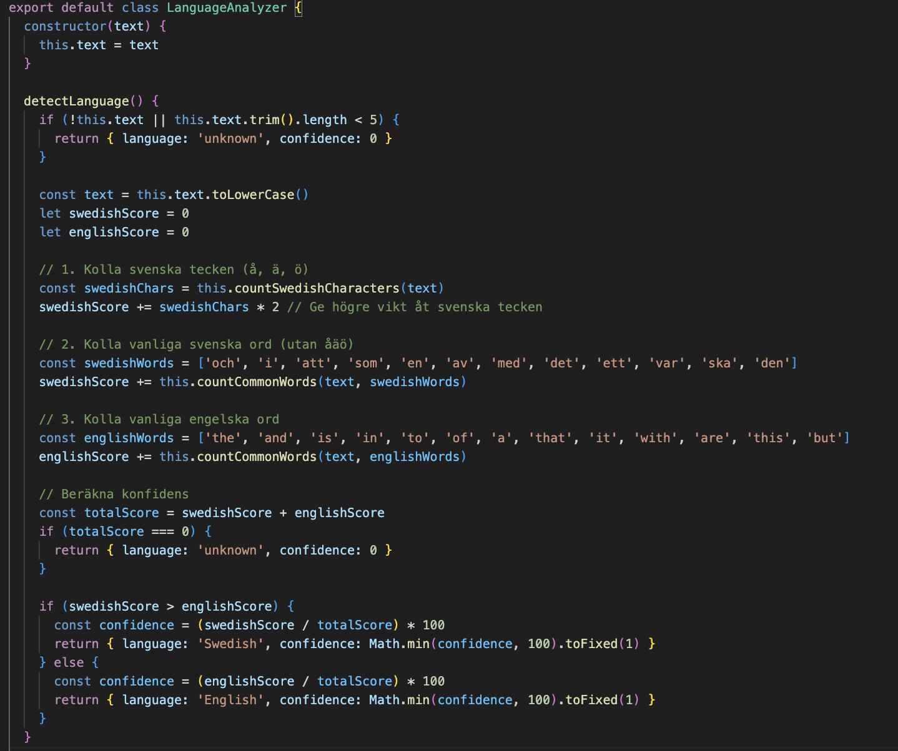
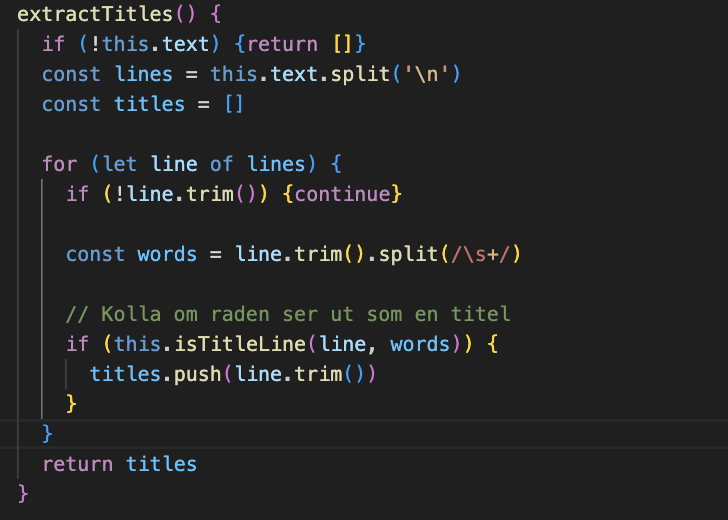
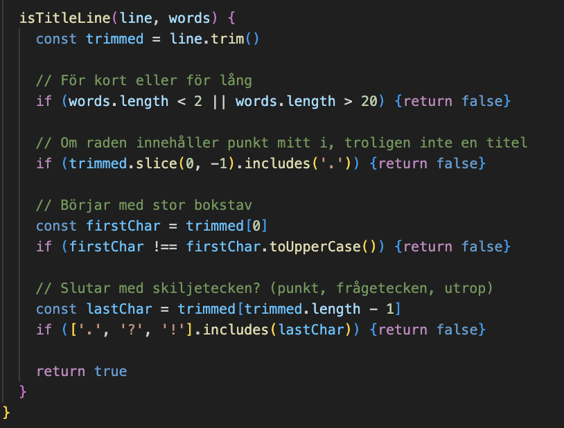
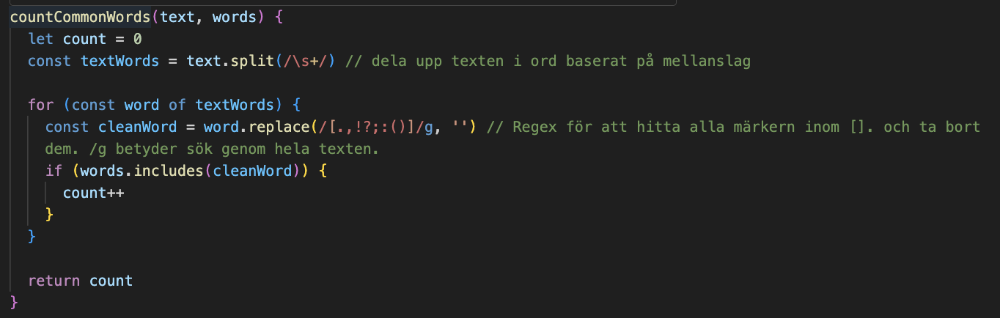
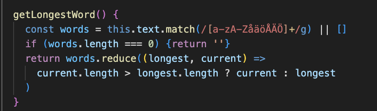

# Tabellreflektion för namngivning

|  | namn | Förklaring | Reflektion och regler från Clean Code |
|-----------|-----------|-----------|-----------|
| 1  | isTitleLine(line, words) | Namn på en metod som avgör om en textrad är en titel eller inte  | **A name should answer it all**: Jag döpte metoden till isTitleLine eftersom den metoden avgör om en textrad är en titel eller inte men det kan bli förrvirade, kunde ha döpt den till isLineTitle så man verkligen förstår att den kollar textlinjen efter titel. |
| 2  |  TitleExtractor | Klass som ansvarar för att extrahera titlar ur en text.  | **Use Intention-Revealing Names:** Namnet berättar tydligt vad klassen gör. **Avoid Noise Words:** “Extractor” är ett relevant ordval, men jag skulle kunna döpa den till DocumentTitleExtractor för att göra sammanhanget tydligare. |
| 3 | detectLanguage()  | Metod som försöker identifiera vilket språk texten är skriven på. | **Method Names:** Börjar med ett verb vilket tydligt signalerar att det är en handling. **Avoid Disinformation:** Ordet “detect” antyder hög precision men metoden uppskattar egentligen bara språket så guessedLanguage() skulle vara ett mer ärligt namn. |
| 4 | countSwedishCharacters() | Metod som räknar antalet svenska tecken (å, ä, ö) i en text. | **Intention-Revealing:** Namnet är självförklarande och lätt att förstå. **Avoid Encoding in Names:** Implementationens regex nämns inte i namnet, vilket är bra. En möjlig förbättring vore att använda countSwedishLetters() “letters” är mer naturligt i detta sammanhang än characters samt underlättar läsförståelsen. |
| 5  | searchWord() | Söker efter ett specifikt ord i texten och returnerar antalet förekomster. | **Verb + Object Pattern:** “searchWord” följer ett tydligt mönster. **Avoid Redundant Context:** Eftersom metoden ligger i klassen WordSearch kunde den kortas till search(), men searchWord() är mer användarvänligt och tydligt för den som anropar modulen. | 

# Reflektions på kaptitel 2

Efter att ha läst kapitel 2 i Clean Code så inser jag att jag följer några av principerna naturligt, till exempel att använda verb för metoder och beskrivande substantiv för klasser samt de principer jag tycker är självklara som don't get cute. Det jag har tagit med mig är särskilt Precision och Transparens i namn, Att ord som "detect", "get" och "is" ger en form av intryck hos läsaren som förväntas ett särskilt resultat. Jag har alltid försökt hålla min namngivning så kort som möjlig men jag håller med om att tydlighet är viktigare än korthet. Och efter jag läst kapitlet tänker jag mer på A namne should answer it all punkterna. 1. Why it exist 2. What it does. 3. How it is used. Innan så tog jag bara ett namn som jag tyckte sammanfattande metoderna jag ville göra, men att ha med sig den principen ger mig en mall, kan man säga. 

# Tabellreflektions på funktioner

| Metodnamn | Kod / Klass | Antal rader | Reflektion |
|------------|--------------|--------------|-------------|
| **detectLanguage()** |  | 21 | **Do One Thing:** Bryter mot regeln, metoden gör flera saker (räknar tecken, räknar ord, beräknar poäng, avgör språk). **One Level of Abstraction:** Både detalj- och beslutslogik blandas. **Improvement:** Dela upp i flera mindre metoder, t.ex. **calculateSwedishScore()**, **calculateEnglishScore()** och **getLanguageConfidence()**. Det skulle öka läsbarhet och testbarhet. |
| **extractTitles()** |  | 10 | **Do One Thing:** Gör nästan en sak, men ansvarar både för att splitta texten, filtrera och validera. **Small:** Rimlig längd, men kunde vara ännu mer fokuserad. **Improvement:** Flytta logiken för radhantering till en ny metod, t.ex. **getValidLines()** eller **filterTitleLines()**. |
| **isTitleLine(line, words)** |  | 9 | **Command Query Separation:** Följer regeln, returnerar endast ett booleskt värde. **Small:** Kort och fokuserad. **Improvement:** Kan göras mer läsbar genom att extrahera logiska kontroller till små hjälpfunktioner, t.ex. **startsWithUppercase()** eller **containsMiddlePeriod()**. |
| **countCommonWords(text, words)** |  | 8 | **Do One Thing:** Gör endast en sak, räknar matchande ord. **Readability:** Tydlig struktur och bra variabelnamn. **Improvement:** Upprepningen av regex-logik **(word.replace(...))** skulle kunna flyttas till en hjälpfunktion **cleanWord()** för bättre återanvändning och läsbarhet. |
| **getLongestWord()** |  | 5 | **Do One Thing:** Följer principen, returnerar längsta ordet. **DRY:** Duplicerar viss logik från **getShortestWord()** (regex och ordextraktion). **Improvement:** Gemensam metod **getWords()** kan minska upprepning och öka tydlighet. |

# Reflektions på kaptitel 3

Efter att ha läst kaptiel 2 i Clean Code så blev det tydligt varför det är viktigt att hålla sina funktioner små och fokuserade. "Do one thing" Jag märkte att flera av mina metoder särskilt detectLanguage() som var den svåraste metoden att göra för mig, blev för lång och gjorde mer än en sak, istället för att försöka få metoden att fungera som jag vill att den skulle göra, istället försöka dela upp den. Det hade nog faktiskt sparat både tid och fått min kod att få bättre struktur samt enklare att förstå/Testa

Det är även väldigt lätt att omedvetet blanda logik och beslutsfattande på olika nivåer i samma metod, vilket försvårar läsningen av koden. Jag ska istället i framtiden försöka använda fler små hjälpfunktioner istället för att få en metod/funktion att fungera utan hjälp, det kanske innebär mer kod men ger tydligare struktur.

## Reflektion över egen kodkvalitet

En styrka jag generellt har är att koden är lätt att läsa, jag försöker använda så passade namn på mina metoder, klasser och allt därimellan för att inte behöva kommentera och förklara dåliga namn som Clean Code förklarar. Istället kommenterar jag endast logik och saker jag själv tycker är svårt att förstå som till exempel regex som jag använder.

Samtidigt finns det såklart saker jag kan förbättra. Min nog längsta metod detectLanguage() är ett tydligt exempel där jag bryter mot reglen **Do One Thing** Den både beräknar språkpoäng, analyserar text och retunerar resultatet, jag borde ha delat upp det i mindre metoder för att minska komplexitetet och öka testbarheten då hade jag också kanske kunnat skippa att använda regex vilket jag med min egna åsikt tycker är svårt att förså.

Sammanfattningsvis tycker jag min kod håller en ganska bra kvalitet för sitt syfte alltså dokumentstatistk men jag hade kunnat bli bättre på att dela upp koden i flera mindre delar samt tänka mer på abstraktionsnivåer och konsekvent struktur. 

Jag tar också med mig att ren kod inte bara ska fungera utan den ska också vara lätt att förstå, ändra och lita på.